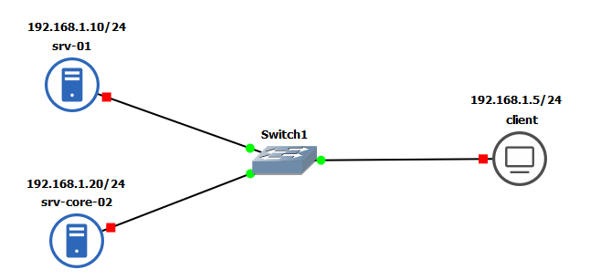
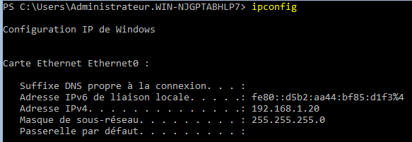

# TP1 (PARTIE 01)

### Infrastructure réseau


### Noms des machines
````bash
# Afficher le noms des machines
hostname
WIN-NJGPTABHLP7

# Modifier le nom
Rename-Computer -NewName "srv-core-02"
AVERTISSEMENT : Les modifications seront prises en compte après le redémarrage de l'ordinateur WIN-NJGPTABHLP7.

# Redemarrage obligatoire
Restart-computer
````
### Configuration réseau
````bash
## index :
Get-NetAdapter

Name                      InterfaceDescription                    ifIndex Status       MacAddress             LinkSpeed
----                      --------------------                    ------- ------       ----------             ---------
Ethernet0                 Intel(R) 82574L Gigabit Network Conn...       4 Up           00-0C-29-D3-B8-5F         1 Gbps

## adressage IP :
New-NetIPAddress -IPAddress "192.168.1.20" -PrefixLength "24" -InterfaceIndex "4"

IPAddress         : 192.168.1.20
InterfaceIndex    : 4
InterfaceAlias    : Ethernet0
AddressFamily     : IPv4
Type              : Unicast
PrefixLength      : 24
PrefixOrigin      : Manual
SuffixOrigin      : Manual
AddressState      : Tentative
ValidLifetime     : Infinite ([TimeSpan]::MaxValue)
PreferredLifetime : Infinite ([TimeSpan]::MaxValue)
SkipAsSource      : False
PolicyStore       : ActiveStore

IPAddress         : 192.168.1.20
InterfaceIndex    : 4
InterfaceAlias    : Ethernet0
AddressFamily     : IPv4
Type              : Unicast
PrefixLength      : 24
PrefixOrigin      : Manual
SuffixOrigin      : Manual
AddressState      : Invalid
ValidLifetime     : Infinite ([TimeSpan]::MaxValue)
PreferredLifetime : Infinite ([TimeSpan]::MaxValue)
SkipAsSource      : False
PolicyStore       : PersistentStore
````
* **Afficher les infos réseaux :**
````bash
ipconfig
````
